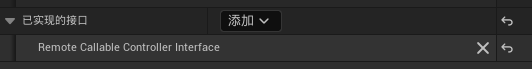
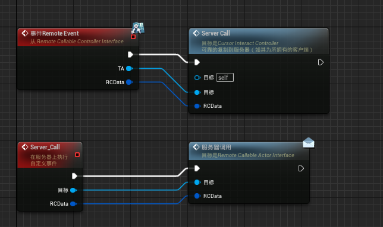
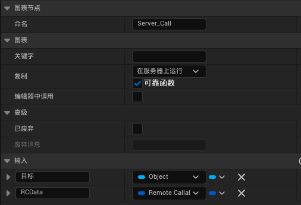
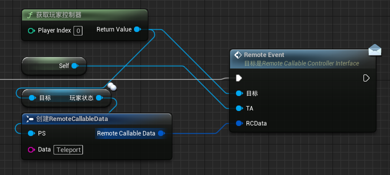
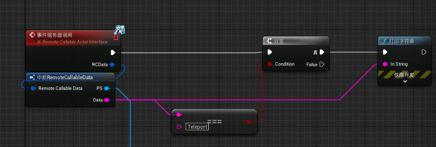

# IndependentActorRPCFramework

独立ActorRPC框架

测试版本：***UE5.2.1***

让每一个Actor都能在自身处理RPC逻辑，这个玩意提供了两个接口，供给控制器和Actor使用。控制器必须要实现接口并设置到游戏内，当设置了之后，实现了Actor接口的将能够自己发送RPC给服务器。这实际上就是靠控制器代理了RPC，但是简化了操作并解除了RPC逻辑耦合。

## 食用说明

1. 引入插件
   
2. 在控制器中实现接口，并添加转发逻辑，
   
   
   
3. 修改游戏模式以使用该控制器类
4. 创建需要进行同步的Actor类，并实现接口
   
5. 添加触发逻辑，在客户端上执行，将本地控制器、Actor本身和数据作为参数。
   
6. 在此Actor中添加服务器执行逻辑
   

# IndependentActorRPCFramework

独立ActorRPC框架

测试版本：***UE5.2.1***

让每一个Actor都能在自身处理RPC逻辑，这个玩意提供了两个接口，供给控制器和Actor使用。控制器必须要实现接口并设置到游戏内，当设置了之后，实现了Actor接口的将能够自己发送RPC给服务器。这实际上就是靠控制器代理了RPC，但是简化了操作并解除了RPC逻辑耦合。

## 食用说明

1. 引入插件
   
2. 在控制器中实现接口，并添加转发逻辑，
   
   
   
3. 修改游戏模式以使用该控制器类
4. 创建需要进行同步的Actor类，并实现接口
   
5. 添加触发逻辑，在客户端上执行，将本地控制器、Actor本身和数据作为参数。
   
6. 在此Actor中添加服务器执行逻辑
   

独立ActorRPC框架

测试版本：***UE5.2.1***

让每一个Actor都能在自身处理RPC逻辑，这个玩意提供了两个接口，供给控制器和Actor使用。控制器必须要实现接口并设置到游戏内，当设置了之后，实现了Actor接口的将能够自己发送RPC给服务器。这实际上就是靠控制器代理了RPC，但是简化了操作并解除了RPC逻辑耦合。
